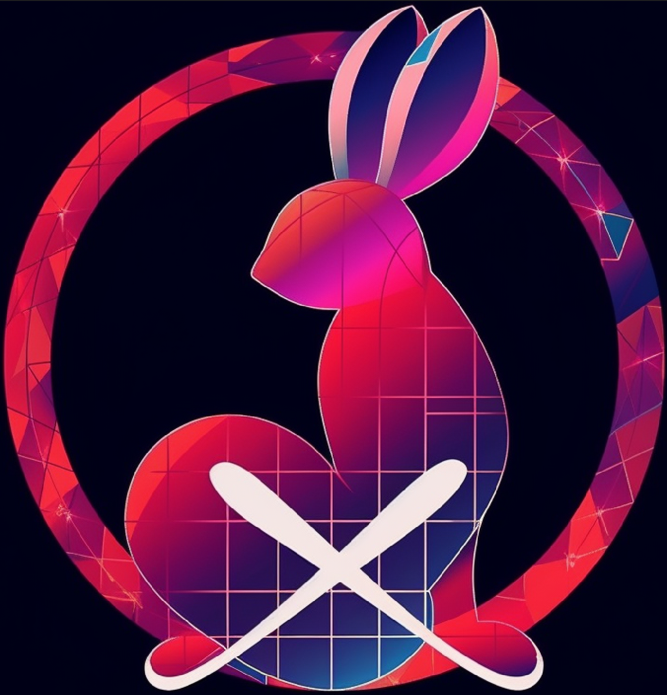

# NexToU: Efficient Topology-Aware U-Net for Medical Image Segmentation
[](https://arxiv.org/abs/2305.15911)

## :bulb: News
* **(June 14, 2023):** NexToU installation and running demo updated.
* **(May 26, 2023):** NexToU architecture and training codes are released.

<p align="center">
  
</p>

> **Abstract:** *Convolutional neural networks (CNN) and Transformer variants have emerged as the leading medical image segmentation backbones. Nonetheless, due to their limitations in either preserving global image context or efficiently processing irregular shapes in visual objects, these backbones struggle to effectively integrate information from diverse anatomical regions and reduce inter-individual variability, particularly for the vasculature. Motivated by the successful breakthroughs of graph neural networks (GNN) in capturing topological properties and non-Euclidean relationships across various fields, we propose NexToU, a novel hybrid architecture for medical image segmentation. NexToU comprises improved Pool GNN and Swin GNN modules from Vision GNN (ViG) for learning both global and local topological representations while minimizing computational costs. To address the containment and exclusion relationships among various anatomical structures, we reformulate the topological interaction (TI) module based on the nature of binary trees, rapidly encoding the topological constraints into NexToU. Extensive experiments conducted on three datasets (including distinct imaging dimensions, disease types, and imaging modalities) demonstrate that our method consistently outperforms other state-of-the-art (SOTA) architectures.* 

## NexToU Architecture Overview

The proposed NexToU architecture follows a hierarchical U-shaped encoder-decoder structure that includes purely convolutional modules and x topological ones. NexToU incorporates improved Pool GNN and Swin GNN modules from [Vision GNN (ViG)](https://github.com/huawei-noah/Efficient-AI-Backbones/tree/master/vig_pytorch), designed to learn both global and local topological representations while minimizing computational costs. It reformulates the [topological interaction (TI)](https://github.com/TopoXLab/TopoInteraction) module based on the nature of binary trees, rapidly encoding the topological constraints into NexToU. This unique approach enables effective handling of containment and exclusion relationships among various anatomical structures. To maintain consistency in data augmentation and post-processing, we base our NexToU architecture on the [nnU-Net](https://github.com/MIC-DKFZ/nnUNet/tree/nnunetv1) framework which can automatically configure itself for any new medical image segmentation task.


## Results

NexToU outperforms state-of-the-art (SOTA) methods in medical image segmentation across various tasks. On the Beyond the Cranial Vault (BTCV) dataset, NexToU achieved an average Dice Similarity Coefficient (DSC) of 87.84% and an average Hausdorff Distance (HD) of 6.33 mm. Additionally, it reached the highest DSC of 74.19% on the intracranial arteries (ICA) dataset. Best results are in bold.


## Qualitative Visualizations

NexToU outperforms alternative models in inter-class boundary segmentation and parameter efficiency. This architecture offers superior segmentation results with fewer misclassifications, specifically in organs like the spleen, liver, stomach, and middle cerebral artery.


## Usage

NexToU consists of several main components. The following links will take you directly to the core parts of the codebase:

- Network Architecture: The network architecture can be found in [NexToU.py](https://github.com/PengchengShi1220/NexToU/blob/NexToU_nnunetv1/network_architecture/NexToU.py).
- Network Training: The file responsible for network training is [nnUNetTrainerV2_nextou.py](https://github.com/PengchengShi1220/NexToU/blob/NexToU_nnunetv1/network_training/nnUNetTrainerV2_nextou.py).
- Binary Topological Interaction (BTI) Loss Function: The BTI loss function is in [BTI_loss.py](https://github.com/PengchengShi1220/NexToU/blob/NexToU_nnunetv1/loss_functions/BTI_loss.py).

To incorporate the functionalities of NexToU with nnUNet, follow the steps given below:

1. Clone the NexToU repository from GitHub using the command:
```
git clone https://github.com/PengchengShi1220/NexToU.git
```

2. Download v1.7.1 version of nnUNet using the command:
```
wget https://github.com/MIC-DKFZ/nnUNet/archive/refs/tags/v1.7.1.tar.gz
```

3. Extract the v1.7.1.tar.gz file using the command:
```
tar -zxvf v1.7.1.tar.gz
```

4. Copy the NexToU loss functions, network architecture, and network training code files to the corresponding directories in nnUNet-1.7.1 using the following commands:
```
cp NexToU/loss_functions/* nnUNet-1.7.1/nnunet/training/loss_functions/
cp NexToU/network_architecture/* nnUNet-1.7.1/nnunet/network_architecture/
cp NexToU/network_training/* nnUNet-1.7.1/nnunet/training/network_training/
```

5. Install nnUNet-1.7.1 with the NexToU related function and run it:
```
cd nnUNet-1.7.1 && pip install -e .
```

For BTCV dataset:
```
nnUNet_train 3d_fullres nnUNetTrainerV2_NexToU_BTI_Synapse Task111_Synapse_CT 0
```

For RAVIR dataset:
```
nnUNet_train 2d nnUNetTrainerV2_NexToU_BTI_RAVIR Task810_RAVIR_vessel_seg 0
```

For ICA dataset:
```
nnUNet_train 3d_fullres nnUNetTrainerV2_NexToU_BTI_ICA_noMirroring Task115_angio_MRA_multi_class 0
```

You can use the relevant components of NexToU in your own projects by importing them from the respective files. Please ensure that you abide by the license agreement while using the code.

If you have any issues or questions, feel free to open an issue on our GitHub repository.

## License

NexToU is licensed under the Apache License 2.0. For more information, please see the [LICENSE](LICENSE) file in this repository.

## Citation
If you use NexToU in your research, please cite:

```
@article{shi2023nextou,
  title={NexToU: Efficient Topology-Aware U-Net for Medical Image Segmentation},
  author={Shi, Pengcheng and Guo, Xutao and Yang, Yanwu and Ye, Chenfei and Ma, Ting},
  journal={arXiv preprint arXiv:2305.15911},
  year={2023}
}
```

